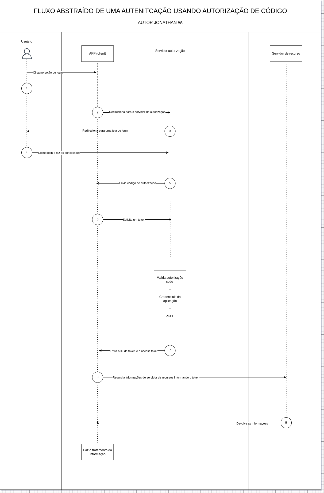

# key-django
Servidor de Autorização usando Django

# Introdução

## O que é o OAuth2

A estrutura de autorização Oauth 2.0 suporta vários fluxos diferentes (ou concessões). Os fluxos são uma maneira de recuperar um token de acesso. Decidir qual o fluxo é o mais adequado para o seu caso de uso depende principalmente do tipo de aplicação, mas outros parâmetros também pesam na sua escolha como o nível de confiança do cliente ou a experiência que deseja que o usuário tenham.

## O cliente pode ser o proprietário do recurso?

Em alguns casos temos uma autorização de máquina para máquina neste caso o cliente é o proprietário também do recurso então não teriamos nenhuma autorização do usuário final. Nesse caso utilizamos o fluxo de credenciais de cliente (credentials client).

## Terminologias

- `Proprietário do Recurso` ou  `Resource Owner` - entidade que pode conceder acesso a um recurso protegido. Normalmente é o usuário final;

- `Cliente` ou `Client` - aplicativo solicitando acesso a um recurso protegido em nome do Proprietário do Recurso;

- `Servidor de Recurso` ou `Resource Server` - servidor responsável por armazenar os dados do proprietário do recurso. Está é API que normalmente você deseja acessar;

- `Servidor de Autorizaçao` ou `Authorization Server` - Servidor que autentica o Proprietário do Recurso e emite o Acess Tokens após obter a autorização. Neste caso é o Auth2.

- `Agente do Usuário` - Agente usado pelo Proprietário do Recurso para interagir com o cliente (por exemplo, um navegador ou aplicativo nativo).

# Autenticão utilizando o fluxo autorização por código

O fluxo de código de autorização (Authorization Code Flow) é definido por meio da RFC 6749, seção 4.1, e envolve a troca de um código de autorização por um token. O fluxo de código de autorização é uma configuração Oauth2 de três etapas. Nessa configuração, o usuário se autentica no servidor de recursos e dá ao aplicativo de um terceiro o consentimento para acessar recursos protegidos. Esse tipo de concessão é destinado principalmente a apps escritos por terceiros e que desejam acessar recursos que não tem uma relação de confiança com o usuário. Esse tipo de concessão garante que as credenciais de usuário do servidor de recursos nunca sejam compartilhados com terceiros.

Nesse tipo de fluxo devemos informar algumas informações como:

- `client_id` - identificador cadastrado no servidor de autorização;
- `redirect_uri` - para onde o usuário deve ser redirecionado posteriormente após o login, ao qual deve ser o mesmo cadastrado no servidor de autorização;
- `response_type` - ao qual deve ser informado o tipo de código que estamos solicitando;
- `scope` - permissões solicitadas, como por exemplo e-mail, perfil, foto e entre outros;
- `state` - string aleatória para prevenir ataques do tipo CSRF

Em alguns casos podemos ter o parâmetro PKCE (Proof Key for Code Exchange), ao qual busca aumentar a segurança do fluxo de autorização de código. Ele é usado para garantir que a mesma aplicação que inicia o fluxo de código é a que finaliza. E como funciona?

Quando um aplicativo nativo vai iniciar uma solicitação de autorização, ao invés de iniciar de forma imediatamente, o cliente cria primeiro o que é chamado de código verificador (`code verifier`), ao qual é uma sequência usando caracteres de A-Z, a-z, 0-9 e caracteres especiais, entre 43 e 128 caracteres de comprimento.

Após a geração do código verificador é possível derivar o desafio do código. Para dispositivo que podem executar um hash SHA256, o desafio de código (`code challenge`) é uma sequência codificada em Base64-URL do hash SHA256.

Exemplo de um PKCE usando python:

```python
import random, string, base64, hashlib

code_verifier = ''.join(random.choice(string.ascii_uppercase + string.digits) for _ in range(random.randint(43, 128))) # Código aleatório

code_challenge = hashlib.sha256(code_verifier.encode('utf-8')).digest() # hash do código verificador
code_challenge = base64.urlsafe_b64encode(code_challenge).decode('utf-8').replace('=', '') # codificação do hash do código verificador
```

O cliente tendo uma string de desafio de código inclui dois parâmetros o `code challenge` e o método utilizado para gerar o desafio (simple ou  S256). Exemplo de requisição de código de autorização:


```bash
http://${URL}?response_type=code&code_challenge=${CODE_CHALLENGE}&code_challenge_method=${CODE_CHALLENGE_METHOD}&client_id=${CLIENT_ID}&redirect_uri=${REDIRECT_URI}&scope=${SCOPE}
```
No exemplo, acima será enviado um desafio de código. O servidor responsável por receber esse código deverá armazenar junto ao código de autorização o code_challenge. Após isso é redirecionado o código de autorização por meio de uma callback ao cliente.

Após a obter os dados do código de autorização podemos solicitar um token para acessar o servidor de recursos para isso podemos executar um código semelhante ao descrito abaixo:

```bash
curl -X POST \
    -H "Cache-Control: no-cache" \
    -H "Content-Type: application/x-www-form-urlencoded" \
    "${URL}" \
    -d "client_id=${ID}" \
    -d "client_secret=${SECRET}" \
    -d "code=${CODE}" \
    -d "code_verifier=${CODE_VERIFIER}" \
    -d "redirect_uri=${URL_CALLBACK}" \
    -d "grant_type=authorization_code"
```

Exemplo de um fluxo utilizando autenticação de autorização de código.



# Construindo o ambiente de desenvolvimento do key-django

Para construção do projeto na stack de desenvovimento deveremos executar os comandos descritos abaixo, ao qual irá instalar todas as dependências do projeto e expor o ambiente na porta 8000.

```
docker compose -f devops/stack-dev.yaml up -d
```

Para acessar o ambiente execute o comando abaixo:

```
docker exec -it iam bash
```

Para que o projeto seja executado é necessário executar o comando descrito abaixo:

```
poetry run task dev
```

## Regras de linter

### Regras gerais

**Regras de formatação**

Para esse projeto foi aplicado todas as regras de formatação do pyflakes (F), ao qual abrange:

- F402 - importação de um módulo dentro de um loop;
- F406 - from {name} import *permitido somente no nível do módulo;
- F523 - .formata chamada tem argumentos não utilizados na(s) posição(ões): {mensagem};
- e entre outras.

**Erros (E) e Avisos, ao qual abrange:**

- E101 - O recuo contém espaços e tabulações mistos;
- E111 - O recuo não é um múltiplo de {indent_width};
- E113 - Recuo inesperado;
- W191 - O recuo contém tabulações;
- W291 - Espaço em branco à direita;
- E entre outros.

**Regras de segurança, ao qual Ruff utiliza regras baseado no Bandit, ao qual inclui regras como**:

- S101 → Uso de assert em produção (pode vazar informações).
- S102 → Uso de exec() (pode ser um risco de injeção de código).
- S103 → Uso inseguro de pickle (pode permitir execução arbitrária de código).
- S104 → Uso inseguro de subprocess sem validação de entrada.
- S105 → Verificação de credenciais ou senhas hardcoded no código.
- S106 → Uso de chaves de API hardcoded.
- S107 → Uso de eval() (pode ser explorado para execução maliciosa).


**PEP-8-naming**

Adoção das convenções de nomes de classes, método e variáveis utilizando o padrão da PEP8.

**Pydoc**

Para as docstring adoção se o padrão de docstrings do Google.

### Migrations

Para as migrations não serão aplicados as regras abaixo:

- D101 - Geralmente, uma documentação de classe deve descrever o propósito da classe e listar seus atributos e métodos públicos, contudo a descrição das funcionalidades estarão descrito nas models;
- E501 - não será realizado mudança dos help_text, será adotado o padrão de comprimento de texto gerado automaticamente pelo django.


## Settings

Para o settings é ignorado as regras abaixo:

- E501 - não é possível a adoção do limite de 79 caracteres nesse arquivo em virtude do path de alguns módulos

Para maiores informações sobre o Ruff e as regras aplicadas consultar: https://docs.astral.sh/ruff/rules/.
